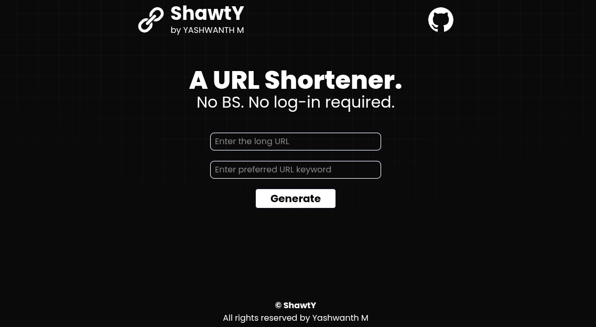

  <a href="https://tailwindcss.com" target="_blank">
    <picture>
      
    </picture>
  </a>

  A URL Shortener. No BS. No log-in required.

---

**ShawtY** takes a long, messy link and turns it into a short, clean one that redirects to the original when visited.

Long URLs are ugly, hard to share, and easy to mistype, especially with tracking params, query strings, or deeply nested paths. 

**ShawtY** makes links:

- **Easier to share:** On social media, chat apps, or verbally, where character limits or readability matter.
- **Cleaner looking:** A short branded link looks more trustworthy and professional than a giant string of random characters.
- **Memorable:** Custom keywords let people create links that are easy to recall instead of random hashes.

 

### App Preview

 

## Tech Stack

- Next.js
- React + React Hook Form
- Tailwind CSS
- MongoDB

## Features

- 🔗 Shorten any long URL into a clean, custom link
- ✏️ You get to choose your own keyword instead of a random hash
- 🚫 Duplicate keyword detection with clear error feedback
- 📋 One-click copy-to-clipboard for the generated short URL
- ⚡ Instant redirects powered by dynamic Next.js routing
- ✅ Form validation with helpful error messages
- 🔒 No login or signup required

## What I Learned

- **Handling Forms with *`React Hook Form`*:** Validation, Error handling, and resetting the input fields after submission
- Building and connecting **API Routes** in Next.js App Router to a MongoDB backend
- Working with **dynamic routes** and server-side redirects using `next/navigation` module
- Connecting Next.js and MongoDB for deployment on Vercel, including environment variables and database network access

## Contributing

You can contribute without any hesitations! To contribute:

1. Fork the repo
2. Create a new branch (`git checkout -b feature/your-feature`)
3. Make your changes
4. Commit (`git commit -m "Add: your feature"`)
5. Push to your fork (`git push origin feature/your-feature`)
6. Open a Pull Request

For major changes, please open an issue first to discuss what you'd like to change.

---