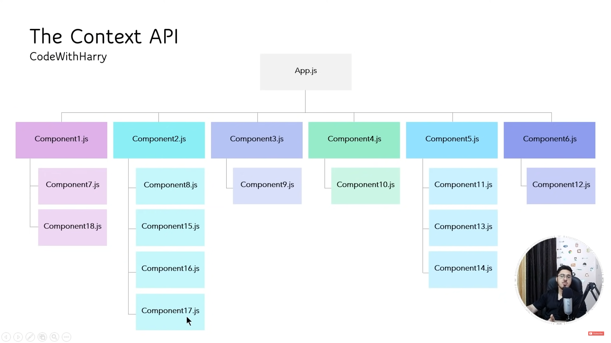

# `useContext` Hook in React

This hook is used to pass data throught the components without passing props down manually at every damn level.

In a React app, data is passed via props. If there are nested components, you have to manually pass data at each component until it reaches the component you want. This is easy to an extent, but when the components are nested heavily, it's a damn headache!

For an example to understand, take a look at this image:


Inside `App.jsx`, we have nested components.

If you want to pass data from `App.jsx` to `Component16.jsx`, you have to pass it in this flow: 
```bash
App.jsx 🡢 Component2.jsx 🡢 Component16.jsx
```

I know that it looks easy, but with increasing components, the headache also increases.

Let's make an app for ourselves to understand the difference.

---

I will take counter app, a simple example to not overcompliacte things.

Our app will have a structure like:
```
App.jsx
└── Navbar.jsx
    └── CountDisplay.jsx
```

I want `Navbar.jsx` to show the current count through `CountDisplay.jsx`.<br>
For that, we have to pass the count value from `App.jsx` to `CountDisplay.jsx`.

Let's do by manually passing the data as props manually.<br>
This method is aka **prop drilling method**.

`App.jsx`
```javascript
import { useState } from "react";
import Navbar from "./components/Navbar";

function App() {

  const [count, setCount] = useState(0)

  const increaseCount = () => {
    setCount(count + 1)
  }

  return (<>
    <Navbar count={count} />

    <h1>Count:{count}</h1>
    <h4 onClick={increaseCount}>Increase Count</h4>
  </>)
}

export default App;
```

<br>

`Navbar.jsx`
```javascript
import CountDisplay from "./CountDisplay"

const Navbar = ({ count }) => {
  return (
    <div>
      <ul className="flex gap-10 p-4 bg-purple-400">
        <li>Home</li>
        <li>About</li>
        <li>Contact</li>
        <li><CountDisplay count={count} /></li>
      </ul>
    </div>
  )
}

export default Navbar;
```

<br>

`CountDisplay.jsx`
```javascript
const CountDisplay = ({count}) => {
  return (<>
    Current count: {count}
  </>)
}

export default CountDisplay;
```

This'll work as we intended, that's for sure.<br>
But we can always do better. Let's use `useContext` now for the same example.<br>

First, create a file `context.js` and add this:
```javascript
import { createContext } from "react";

export const countContext = createContext(0);
```

`App.jsx`
```javascript
import { useState } from "react";
import Navbar from "./components/Navbar";
import { countContext } from "./context";

function App() {

  const [count, setCount] = useState(0)

  const increaseCount = () => {
    setCount(count + 1)
  }

  return (<>
    <countContext.Provider value={count}>
      <Navbar />

      <h1>Count:{count}</h1>
      <h4 onClick={increaseCount}>Increase Count</h4>
    </countContext.Provider>
  </>)
}

export default App;
```

<br>

`Navbar.jsx`
```javascript
import CountDisplay from "./CountDisplay"

const Navbar = () => {
  return (
    <div>
      <ul className="flex gap-10 p-4 bg-purple-400">
        <li>Home</li>
        <li>About</li>
        <li>Contact</li>
        <li><CountDisplay /></li>
      </ul>
    </div>
  )
}

export default Navbar;
```

<br>

`CountDisplay.jsx`
```javascript
import { useContext } from "react"
import { countContext } from "../context"

const CountDisplay = () => {
  const count = useContext(countContext)
  return (<>
    Current count: {count}
  </>)
}

export default CountDisplay;
```

Notice one thing? We didn't have to involve `Navbar.jsx` in it at all.<br>
The data was passed from `App.jsx` to `CountDisplay.jsx` directly.

In `App.jsx`, we wrapped the returning fragment in `<countContext.Provider>` tag.<br>
That is the main character here, which made the direct transfer possible.

If you still didn't understand `useContext` hook, read this simple explaination, dumbass!

If you want to pass the data from **Component3** to **Component8**, you have to pass the data like this:
```bash
Component3 🡢 Component4 🡢 Component5 🡢 Component6 🡢 Component7 🡢 Component8
```

This would be soooooooooo awful to do!
But if we use `useContext` in this scenario, the passing of data will look like:
```bash
Component3 🡢 Component8
```

That's it. This is `useContext` basically.