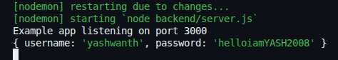

# Handling Forms & Connecting React to Express Backend

## Handling Forms in React.js

We know that handling input ain't that easy in React.js.<br>
We can't just add `<input>` tag and get the value.<br>
We have to handle the change by creating functions, which is exhausting.

For example, I made this simple form which takes ***username*** and ***password*** as inputs and submits it by logging it into the console. I handled the form inputs using the functions `handleChange()` and `handleSubmit()`.
```javascript
import { useState } from 'react'

function App() {
  const [form, setForm] = useState({ username: "", password: "" })

  const handleChange = (e) => {
    const { name, value } = e.target
    setForm(prev => ({ ...prev, [name]: value }))
  }

  const handleSubmit = (e) => {
    e.preventDefault()
    console.log(form)
  }

  return (<>
    <h1 className='text-4xl text-center m-5'>FORM</h1>

    <form onSubmit={handleSubmit} className='flex flex-col gap-5 justify-center items-center'>
      <input type='text' name='username' value={form.username} onChange={handleChange} placeholder='enter username' className='max-w-[20vw] pl-5 text-black' />
      <input type='password' name='password' value={form.password} onChange={handleChange} placeholder='enter password' className='max-w-[20vw] pl-5 text-black' />

      <button type="submit" className='bg-green-900 px-3 py-1'>Submit</button>
    </form>
  </>)
}

export default App
```

Everything is okay here.<br>
But with many inputs in the form, it's a hell handling every change using a function.

There is a library called **React Hook Form**, which is exactly made for solving this issue.

First things first, install it:
```bash
npm install react-hook-form
```

With this library, see how easy the handling task becomes for the same example:
```javascript
import { useForm } from "react-hook-form"

function App() {
  const { register, handleSubmit, watch, formState: { errors } } = useForm();

  const onSubmit = (data) => console.log(data)

  return (<>
    <h1 className='text-4xl text-center m-5'>FORM</h1>

    <form onSubmit={handleSubmit(onSubmit)} className='flex flex-col gap-5 justify-center items-center'>
      <input type='text' {...register("username")} placeholder='enter username' className='max-w-[20vw] pl-5 text-black' />
      <input type='password' {...register("password")} placeholder='enter password' className='max-w-[20vw] pl-5 text-black' />

      <button type="submit" className='bg-green-900 px-3 py-1'>Submit</button>
    </form>
  </>)
}

export default App
```

**See?** I did the same task so easily.<br>
- I didn't have to use `useState`.<br>
- I didn't have to create `handleChange` and `handleSubmit` functions.<br>
- I didn't have to give `name` and `value` attributes to the input element.<br>
- I didn't have to attach event listener to the input element.

This is why **React Hook Form** library is a must for the development of forms in React.js

Not only handling, we can do sooooooo much more.<br>
We can also validate inputs so easily it feels illegal.

```javascript
import { useForm } from "react-hook-form"

function App() {
  const { register, handleSubmit, watch, formState: { errors } } = useForm();

  const onSubmit = (data) => console.log(data)

  return (<>
    <h1 className='text-4xl text-center m-5'>FORM</h1>

    <form onSubmit={handleSubmit(onSubmit)} className='flex flex-col gap-5 justify-center items-center'>
      <input type='text' placeholder='enter username' className='max-w-[20vw] pl-5 text-black'
        {...register("username", {
          required: { value: true, message: "Username field must be filled!" },
          minLength: { value: 3, message: "Minimum 3 characters required in username!" },
          maxLength: { value: 10, message: "Maximum 10 characters allowed in username!" }
        })}
      />

      <input type='password' placeholder='enter password' className='max-w-[20vw] pl-5 text-black'
        {...register("password", {
          required: { value: true, message: "Password field must be filled!" },
          minLength: { value: 8, message: "The password must be 8 characters long!" },
        })}
      />

      <button type="submit" className='bg-green-900 px-3 py-1'>Submit</button>

      {errors.username &&
        <div className="text-red-600">
          WARNING: {errors.username.message}
        </div>
      }

      {errors.password &&
        <div className="text-red-600">
          WARNING: {errors.password.message}
        </div>
      }
    </form>
  </>)
}

export default App
```

This might seem a lot, but this is actually so much less than traditional React.js form validation handling.

The `message` can be whatever we want.<br>
The error message will automatically load when there's problem with the given inputs.<br>

If everything is fine, the form will be submitted successfully, and you can see the data in the console.

Let me show you one more thing because **WHY NOT???**<br>
Remember, my man, *"Don't Stop Til You Get Enough!"*. It was said by Michael Jackson, by the way.

We can do these tasks too:
- Show **Loading...** while the form is being submitted.
- Prevent the user from submitting the form multiple times while the form is being submitted.
- Disable the `Submit` until the form is successfully submitted.
- Show **Form submitted successfully!** when the form is submitted.

```javascript
import { useForm } from "react-hook-form"

function App() {
  const { register, handleSubmit, watch, formState: { errors, isSubmitting, isSubmitSuccessful } } = useForm();

  const fakeDelay = (delay) => {
    return new Promise((resolve, reject) => {
      setTimeout(() => {
        resolve()
      }, delay * 1000)
    })
  }

  const onSubmit = async (data) => {
    await fakeDelay(3)
    console.log(data)
  }

  return (<>
    <h1 className='text-4xl text-center m-5'>FORM</h1>

    <form onSubmit={handleSubmit(onSubmit)} className='flex flex-col gap-5 justify-center items-center'>
      <input type='text' placeholder='enter username' className='max-w-[20vw] pl-5 text-black'
        {...register("username", {
          required: { value: true, message: "Username field must be filled!" },
          minLength: { value: 3, message: "Minimum 3 characters required in username!" },
          maxLength: { value: 10, message: "Maximum 10 characters allowed in username!" }
        })}
      />

      <input type='password' placeholder='enter password' className='max-w-[20vw] pl-5 text-black'
        {...register("password", {
          required: { value: true, message: "Password field must be filled!" },
          minLength: { value: 8, message: "The password must be 8 characters long!" },
        })}
      />

      <button type="submit" disabled={isSubmitting} className='bg-green-900 px-3 py-1'>
        Submit
      </button>

      {errors.username &&
        <div className="text-red-600">
          WARNING: {errors.username.message}
        </div>
      }

      {errors.password &&
        <div className="text-red-600">
          WARNING: {errors.password.message}
        </div>
      }

      {isSubmitting &&
        <div className="text-blue-400">Loading...</div>
      }

      {isSubmitSuccessful &&
        <div className="text-green-400">Form submitted successfully!</div>
      }
    </form>
  </>)
}

export default App
```

I know. I know. The code became long. I can understand.<br>
- I added `isSubmitting` and `isSubmitSuccessful` in `formState`.
- I created a function `fakeDelay()` to simulate network delay, which takes place in real-life. This is when **Loading...** shows up.
- I disabled `Submit` button when the form is being submitted, using `isSubmitting`.
- I gave acknowledgement **FORM SUBMITTED SUCCESSFULLY!** when the form is submitted, using `isSubmitSuccessful`.

I added so many features in it. That's why the code became long.<br>
You know, everything comes at a price.<br>
Now the code is a lot better!

You can also do custom validations, by the way.<br>
I want the form to be submitted only when it's done by me (when the **username** is 'yashwanth').<br>
If not, show a warning.

```javascript
import { useForm } from "react-hook-form"

function App() {
  const { register, handleSubmit, setError, watch, formState: { errors, isSubmitting, isSubmitSuccessful } } = useForm();

  const fakeDelay = (delay) => {
    return new Promise((resolve, reject) => {
      setTimeout(() => {
        resolve()
      }, delay * 1000)
    })
  }

  const onSubmit = async (data) => {
    await fakeDelay(3)

    if (data.username !== "yashwanth") {
      setError("blocked", { message: "You don't have access to submit the form!" })
    }

    console.log(data)
  }

  return (<>
    <h1 className='text-4xl text-center m-5'>FORM</h1>

    <form onSubmit={handleSubmit(onSubmit)} className='flex flex-col gap-5 justify-center items-center'>
      <input type='text' placeholder='enter username' className='max-w-[20vw] pl-5 text-black'
        {...register("username", {
          required: { value: true, message: "Username field must be filled!" },
          minLength: { value: 3, message: "Minimum 3 characters required in username!" },
          maxLength: { value: 10, message: "Maximum 10 characters allowed in username!" }
        })}
      />

      <input type='password' placeholder='enter password' className='max-w-[20vw] pl-5 text-black'
        {...register("password", {
          required: { value: true, message: "Password field must be filled!" },
          minLength: { value: 8, message: "The password must be 8 characters long!" },
        })}
      />

      <button type="submit" disabled={isSubmitting} className='bg-green-900 px-3 py-1'>
        Submit
      </button>

      {errors.username &&
        <div className="text-red-600">
          WARNING: {errors.username.message}
        </div>
      }

      {errors.password &&
        <div className="text-red-600">
          WARNING: {errors.password.message}
        </div>
      }

      {isSubmitting &&
        <div className="text-blue-400">Loading...</div>
      }

      {isSubmitSuccessful &&
        <div className="text-green-400">Form submitted successfully!</div>
      }

      {errors.blocked &&
        <div className="text-red-600">
          WARNING: {errors.blocked.message}
        </div>
      }
    </form>
  </>)
}

export default App
```

Now, the form is only submitted successfully when the `username` is 'yashwanth'.

This is just a drop worth of power of **React Hook Form** library. It's a vast ocean, really.<br>
Try to learn more about **React Hook Form** by clicking [here](https://react-hook-form.com/get-started).

---

## Connecting React to Express Backend

Alright, we made a simple form which takes **username** and **password**.<br>
Now, let's get the submitted data into the backend.<br>
I mean, we didn't create a form just to display the data in the console, right?

Create a folder called `backend` and make a file `server.js`.<br>
This is to separate the frontend and backend part of our app.

**NOTE:** The app is gonna be a **Express.js** app.

`server.js`
```javascript
import express from "express"

const app = express()
const port = 3000

app.get('/', (req, res) => {
  res.send('Hello World!')
})

app.post('/', (req, res) => {
  console.log(req.form)
})

app.listen(port, () => {
  console.log(`Example app listening on port ${port}`)
})
```
<br>

`App.jsx`

I removed the fake delay in `App.jsx`'s `onSubmit` function and made it fetch the form data using Fetch API.
```javascript
const onSubmit = async (data) => {

  let formData = fetch(
    "http://localhost:3000/",
    {
      method: "POST",
      headers: { "Content-Type": "application/json" },
      body: JSON.stringify(data)
    }
  )
    
  let res = await formData.text

  console.log(data, res)
}
```

This has a problem. It'll not fetch the data when we hit **Submit**. It'll show the error:
```
Access to fetch at 'http://localhost:3000/' from origin
'http://localhost:5173' has been blocked by CORS policy:
No 'Access-Control-Allow-Origin' header is present on the requested resource.
```

To solve this issue, we have to install some npm packages.
```bash
npm i cors
npm i body-parser
```
And use both of them in our app in `server.js`.
```javascript
app.use(cors())
app.use(bodyParser.json())
```

After all this work, the form will work just fine.<br>
The data will get to the backend without any problem.<br>

This is the proof that the data successfully came to the backend:


Now, we can do anything with the data in the backend.<br>
Push it to a database, for example.

And... this is how you connect your React app to an Express.js backend.

---