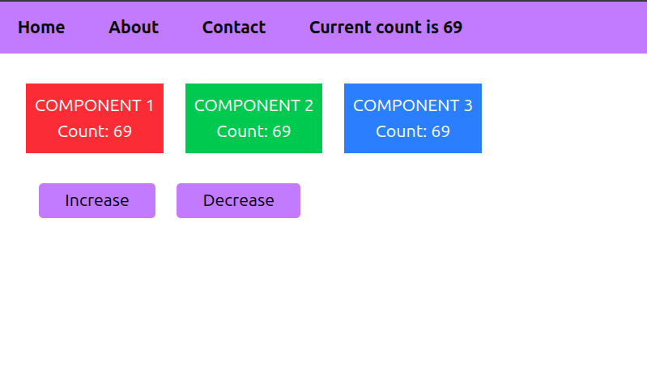

## Redux Library of JavaScript

Redux is a state management library.<br>
Instead of storing data inside one component, Redux stores it in one global place.<br>
Any component can use and edit that state.

Imagine the app has 3 different components and sll of them need one state.<br>
You can do **prop drilling method**, which is tedious and not recommended.

By using **Redux**, we can make all the components of the app get that value.

If you really have some React.js knowledge, you should get this question in your mind:<br>
*"We can use `useContext`, right? That hook is made for this shit."*

The answer is "yes-no".<br>
If you app is small and simple, you can depend on `useContext` and be done with it.<br>
But, if you are building a big app like e-commerce website, `useContext` can't give you the upper hand.<br>
You must choose **Redux** over `useContext` in this.

Before proceeding to the example, you need to see some **Redux** terminologies, or else you'll be like *"Eh? Eh? Eh?"* the whole time you are reading this chapter.

---
**STORE:** It's the place where all your app's data (aka *state*) lives.

**ACTION:** It's an object describing what should happen to the state.

**DISPATCH:** It sends an action to the reducer.

**REDUCER:** It's a function that changes the state based on the action.

**SELECTOR:** It reads data from the store. (Can't write, just read.)

---

I am creating an app, which I will use to demonstrate the usage of **Redux**.

The app is simple. It's a counter app.<br>
It has these - Navbar, Component1, Component2, Component3, IncreaseButton, DecreaseButton.

All the above 6 components need the value of `count`.

This is how the app should look:<br>


Okay! Let's start buildin' it!

First, install **Redux**:
```bash
npm install @reduxjs/toolkit react-redux
```

Make this project structure:
```
app_folder
└── src/
    ├── components/
    │   ├── Component 1.jsx  
    │   ├── Component 2.jsx  
    │   ├── Component 3.jsx  
    │   ├── Component 3.jsx  
    │   ├── DecreaseCount.jsx  
    │   ├── IncreaseCount.jsx  
    │   └── Navbar.jsx
    │
    ├── features/
    │   └── counterSlice.js
    │
    └── store/
        └── store.js
```

Let's do this thing properly step-by-step because it is a difficult thing to grasp at the first glance.

<br>

### STEP 1: Add this to `src/store/store.js`

```javascript
import { configureStore } from "@reduxjs/toolkit";
import counterReducer from "../features/counterSlice";

export const store = configureStore({
  reducer: {
    counter: counterReducer,
  },
});
```
I'm importing a function called `configureStore`, which is responsible of creating the Redux store.<br>
`counterReducer` is the reducer function defined in `counterSlice.js`, you'll see it soon.

Inside `reducer`, `counter` is the state, and `counterReducer` will be the one managing that state.

<br>

### STEP 2: Add this to `src/features/counterSlice.js`

```javascript
import { createSlice } from "@reduxjs/toolkit";

const counterSlice = createSlice({
  name: "counter",

  initialState: {
    count: 0
  },

  reducers: {
    increase(state) {
      state.count++;
    },

    decrease(state) {
      state.count--;
    }
  },
});

export const { increase } = counterSlice.actions;
export const { decrease } = counterSlice.actions;

export default counterSlice.reducer;
```
I'm importing `createSlice`. The name itself says what it does - it creates a slice.<br>
The name of this slice is **counter** as you can see.<br>
The `count` state is initialzed with 0.<br>
Then I added some reducer functions inside `reducers`. These function are what helps us to change the state.

<br>

### STEP 3: Create the 6 components, man!

`Navbar.jsx`
```javascript
import { useSelector } from "react-redux";

function Navbar() {

  const count = useSelector(state => state.counter.count);

  return (<>
    <ul className="flex gap-10 px-5 py-3 bg-purple-400 font-bold">
      <li>Home</li>
      <li>About</li>
      <li>Contact</li>
      <li>Current count is {count}</li>
    </ul>
  </>)
}

export default Navbar;
```

<br>

`Component1.jsx`
```javascript
import { useSelector } from "react-redux";

function Component1() {

  const count = useSelector(state => state.counter.count);

  return (<>
    <div className="bg-red-500 p-2 min-h-[10vh] text-white flex flex-col justify-center items-center">
      <h1>COMPONENT 1</h1>
      <h1>Count: {count}</h1>
    </div>
  </>);
}

export default Component1
```

<br>

`Component2.jsx`
```javascript
import { useSelector } from "react-redux";

function Component2() {

  const count = useSelector(state => state.counter.count);

  return (<>
    <div className="bg-green-500 p-2 min-h-[10vh] text-white flex flex-col justify-center items-center">
      <h1>COMPONENT 2</h1>
      <h1>Count: {count}</h1>
    </div>
  </>);
}

export default Component2
```

<br>

`Component3.jsx`
```javascript
import { useSelector } from "react-redux";

function Component3() {

  const count = useSelector(state => state.counter.count);

  return (<>
    <div className="bg-blue-500 p-2 min-h-[10vh] text-white flex flex-col justify-center items-center">
      <h1>COMPONENT 3</h1>
      <h1>Count: {count}</h1>
    </div>
  </>);
}

export default Component3
```

<br>

`IncreaseCount.jsx`
```javascript
import { useDispatch } from "react-redux";
import { increase } from "../features/counterSlice";

function IncreaseButton() {

    const dispatch = useDispatch();

    return (
        <button onClick={() => dispatch(increase())} className="bg-purple-400 px-6 py-1 rounded-sm">
            Increase
        </button>
    )
}

export default IncreaseButton
```

<br>

`DecreaseCount.jsx`
```javascript
import { useDispatch } from "react-redux";
import { decrease } from "../features/counterSlice";

function DecreaseButton() {

  const dispatch = useDispatch();

  return (
    <button onClick={() => dispatch(decrease())} className="bg-purple-400 px-6 py-1 rounded-sm">
      Decrease
    </button>
  )
}

export default DecreaseButton
```
<br>

If you notice one thing, in most of the components, this line is common:
```javascript
const count = useSelector(state => state.counter.count);
```
That's the `useSelector` reading the state, so we can get the value of `count`.<br>
See, this is so much easier than **prop drilling** and `useContext`.

<br>

In `IncreaseCount.jsx` and `DecreaseCount.jsx`, this is common:
```javascript
const dispatch = useDispatch();
```
`useDispatch` hook is used here to send action to the `increase()` and `decrease()` so the state changes.

<br>

### STEP 4: Merge all the components into one app
`App.jsx`
```javascript
import Navbar from "./components/Navbar";
import Component1 from "./components/Component1";
import Component2 from "./components/Component2";
import Component3 from "./components/Component3";
import IncreaseButton from "./components/IncreaseCount";
import DecreaseButton from "./components/DecreaseCount";

function App() {

  return (<>
    <Navbar />

    <div className="m-7 flex gap-5">
      <Component1 />
      <Component2 />
      <Component3 />
    </div>

    <div className="flex gap-5 px-10">
      <IncreaseButton />
      <DecreaseButton />
    </div>
  </>)
}

export default App;
```

<br>

### STEP 5: Add this in `main.jsx`

In `main.jsx`:

Import these two:
```javascript
import { Provider } from "react-redux";
import { store } from "./store/store.js";
```

And then... wrap the **App** inside **Provider**:
```javascript
<Provider store={store}>
  <App />
</Provider>
```

Now the app will the same as it was in the image.

---

**Redux** might feel overwhelming at this point. And, it's okay.<br>
But, it is one of the crucial concepts to learn.

Try to do some projects based on Redux.<br>
You'll learn it more easily.

That's because project-based learning is the best method of learning!

---