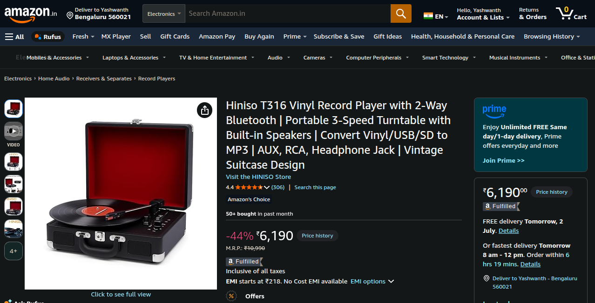
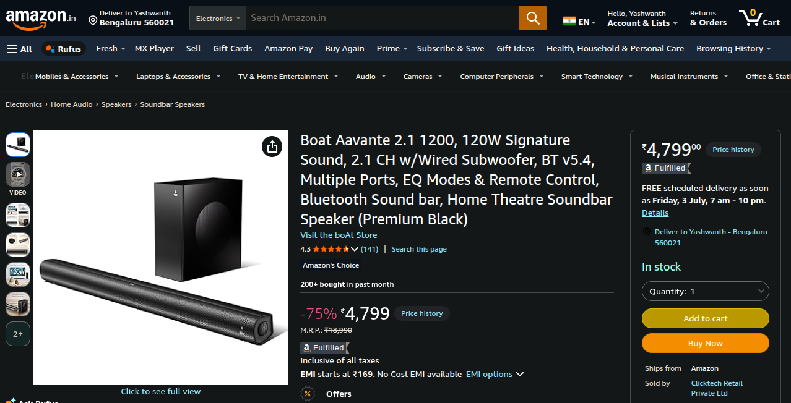

# Dynamic Routing in Next.js

This topic is a super-important concept. So, give your full focus!

You know, in Next.js, one file serves one page. For example, `app/about/page.js` only serves `/about` page. But, with dynamic routing, we can let one file server infinite pages. Yes, you heard it right. **INFINITE!!!**

You create it by wrapping a folder name in square brackets:
```
app/movies/[slug]/page.js
```

That `[slug]` isn't a folder name, it's a variable.  
It catches any value in that position and renders the page based on that value.  
If you visit `movies/interstellar/`, **"interstellar"** is the slug here. The page `page.js` renders based on this slug.

The `page.js` component takes that slug and uses it as a key against the data *(could be an array, a database, an API, it doesn't matter)*. If it finds the data for slug, it renders that data, which we'll see. If not found, 404 error.

Let me show you a good real-life example. That will be the best explaination.

---

Have you ever been to **Amazon** webiste? Obviously, you would have.  
Imagine you are in your wishlist, and there are 2 items. There can be 10 items, I don't know, but just assume you have 2 items.

<br>



<br>



See these 2 pages? They are 2 different pages.  
But... they live under the same folder. Like:
```
amazon.com/your-wishlist/item-001
amazon.com/your-wishlist/item-002
```

You think Amazon has an individual page dedicated for your shitty wishlist items? **NO!!! Hell, no!**  
They create one single template, and use it for every items in their website.  
Just look at these 2 images. The layout is same, just the data differs. See it?

That **"template"** is the slug here.
```
amazon.com/your-wislist/[slug]
```
If you go to item 1, the slug will become item-1 and data of that specific item is shown on the page.  
The data will sent to the page via props. The props might differ, the layout won't.

That is **Dynamic Routing**. Simple as that.

---

Okay, leave the Amazon alone now. Think of an example yourself.  

I made this example for myself to understand dynamic routing.

I want to display Christopher Nolan's movies in card format.  
Currently, he has 13 movies. I have data of these 13 movies in an array.  
The data can be brought by an API, a database, it doesn't matter. Data is data.  
If I visit `app/movies/inception`, I should see Inception movie details.  
If I visit `app/movies/the-dark-knight`, I should see The Dark Knight movie details.  
This is the goal. Let's see how it's done.

First, I created a file `app/movies/[slug]/page.js`.
```javascript
import { notFound } from 'next/navigation'
import { movies } from '../../data/movies'
import Image from 'next/image'

export default async function MoviePage({ params }) {
  const { slug } = await params
  const movie = movies.find((m) => m.slug === slug)

  if (!movie) {
    notFound()
  }

  return (<>
    <div className='max-w-[60vw] m-auto border border-white p-5 rounded-sm'>
      <div className="flex gap-5 items-center justify-center">
        <div className='movie_poster'>
          <Image src={movie.poster} alt={movie.title} width={500} height={150} />
        </div>
        <div className='movie_details'>
          <h1 className='text-7xl'>{movie.title}</h1>
          <p className='text-2xl'>{movie.year}</p>
          <p className='mt-5'>{movie.description}</p>
        </div>
      </div>
    </div>
  </>);
};
```
This file is the **"template"**.  
If the data is found, the page renders that movie page. If not, 404 error will pop up.  
Just try it out, you will see.

---

**Why the hell should I use it?**

- If you don't use this, you have to create a page dedicated to one movie. If you have 100 movies, you have to copy-paste and create 100 files. Would you want that?
- You don't have to change the code when the data changes. If a new row is added in the database, a new page exists. You don't have to change anything in the code.
- As we are using one single template, every movie page will have the same structure. You can change the layout once, all movie pages will have the new structure. No need to change the layout one-by-one for each movie page.
- Whether you have 5 movies or 5 million movies, it's still one file, basically. The scaling becomes an advantage.

So, better learn this concept well. It's gonna be useful for you.

---